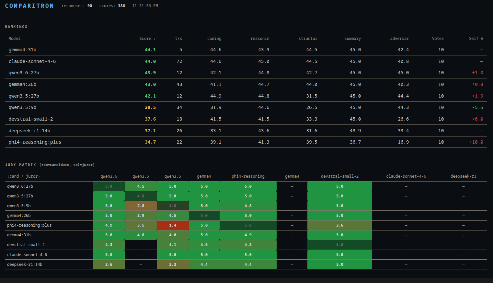

# Comparitron

A local LLM benchmark tool. Run a set of prompts across multiple Ollama models, score the responses with a jury of peer models, and watch the leaderboard update in real time.



| | | |
|---|---|---|
|  |  |  |

## Hardware configurations

Results are hardware-dependent — document which config was used when comparing runs.

### chonko (primary inference node)
| Component | Detail |
|---|---|
| Host | Dell PowerEdge R740 |
| GPU | Tesla P40 24GB (Pascal, CUDA 6.1) |
| RAM | 188GB |
| Ollama URL | `http://chonko:11434` |
| Notes | No Tensor Cores, no bfloat16, no Flash Attention 2. Q4_K_M inference only. Large models (32B+) via VRAM+RAM offload — functional but slow. |

### aid (image/video generation)
| Component | Detail |
|---|---|
| GPU | RTX 4060 Ti 16GB |
| Role | A1111 / ComfyUI / SD only — not used for LLM inference |
| Notes | R9700 (32GB VRAM, RDNA4) arriving May 2026 — will replace 4060 Ti for SD, may add LLM capacity pending ROCm/Ollama RDNA4 support |

When re-running on a different machine, update `ollamaHost` in `config.js` and note the hardware in your results.

## How it works

**Runner** — sends each prompt to each candidate model via the Ollama API and caches the response.

**Jury** — for every cached response, each juror model scores it on four dimensions (1–5 each):

| Dimension | Weight |
|---|---|
| `correctness` | 4 |
| `instruction_following` | 2 |
| `format_compliance` | 2 |
| `conciseness` | 1 |

Max score: **45** (sum of weights × 5).

Scores are cached per `(candidate, prompt, juror)` tuple — safe to interrupt and resume at any point. Adding a new model or juror only runs the missing entries.

**Self-preference tracking** — the jury matrix shows each model's score when judged by itself vs. by peers. The `Self Δ` column flags self-serving bias.

**Watch / Server** — a terminal watcher (`watch.js`) and an HTTP server (`server.js`) both read from the same aggregated data and update live.

## Quick start

```bash
# 1. Configure candidates and jurors
vi config.js

# 2. Run all candidates against all prompts
node comparitron.js run

# 3. Score all responses
node comparitron.js jury

# 4. Print the report
node comparitron.js report

# Watch live (separate terminal)
node bin/watch.js

# Web UI (default port 3773)
node bin/server.js
```

Steps can be run independently or all at once:

```bash
node comparitron.js          # run + jury + report
node comparitron.js run jury # run then jury, skip report
```

## Configuration

`config.js` — all tuneable knobs in one place:

```js
module.exports = {
  ollamaHost: 'http://chonko:11434',  // Ollama endpoint
  candidates: [                        // models to benchmark
    'gemma4:26b',
    'phi4-reasoning:plus',
    // ...
  ],
  jurors: [                            // models that score responses
    'gemma4:26b',
    'phi4-reasoning:plus',
    'qwen2.5:14b',
    'qwen2.5:7b',
  ],
  scenarios: ['coding', 'reasoning', 'structured', 'summary'],
  resultsDir: './results',
  promptsDir: './prompts',
  candidateTemp: 0.7,   // temperature for response generation
  judgeTemp:    0.1,    // temperature for scoring (low = consistent)
  chatTimeoutMs: 666000,
  serverPort: 3773,
}
```

`candidates` controls what the runner benchmarks and the display order. Any model with response files on disk will appear in the leaderboard regardless — useful for models scored via external runners (e.g. `bin/claude-runner.js`).

## Capability suites

Prompts live in `capabilities/<suite>.json`. Each entry has an `id`, a `prompt`, and an optional `evalHint` that is **not** shown to jurors (it's for your reference only).

| Suite | Tests |
|---|---|
| `coding` | Correctness, edge cases, code quality |
| `reasoning` | Step-by-step logic, causal analysis |
| `structured` | Strict JSON output compliance |
| `summary` | Constraint following (word limits, bullet counts) |
| `adversarial` | Trap prompts — math comparisons, physical state tracking. Reveals failures quality scores hide. |

Add new prompts by editing the JSON files. Add new suites by creating `capabilities/<name>.json` and adding the name to `config.capabilities`.

## Benchmarking a non-Ollama model

Use `bin/claude-runner.js` as a template for any model with an external API. It reads the same prompt files and writes to the same `results/responses/` cache format. The jury and watcher pick up the files automatically.

```bash
ANTHROPIC_API_KEY=sk-... node bin/claude-runner.js
```

The model name (`claude-sonnet-4-6`) does not need to be in `config.candidates` — the aggregator discovers it from disk. The jury will score it; it will not be asked to be a juror (only `config.jurors` models are called for scoring).

> **Note — Claude response quality:** The current `claude-sonnet-4-6` responses were generated manually (no API key) in Claude Code's medium inference mode. Medium mode trades some response quality for speed. For a true ceiling reference, re-run via `bin/claude-runner.js` with a full-mode API key — responses generated at full capability will likely score higher, particularly on reasoning and coding tasks. The adversarial responses (`math_trap`, `state_tracking`) were written deliberately and are unaffected by this.

## Results layout

```
results/
  responses/   <scenario>_<promptId>_<model>.json   — one per (prompt, model)
  scores/      <scenario>_<promptId>_<candidate>_by_<juror>.json  — one per (prompt, candidate, juror)
```

All files are plain JSON. Safe to delete individual entries to force a re-run.

## Design notes

### Auto-scoring for objective prompts

Some capability prompts have deterministic correct answers — the `adversarial` suite is the primary example (`math_trap`, `state_tracking`). These prompts carry an `answer` field in their JSON definition.

A future improvement would be auto-scoring these without the full jury pass: run a lightweight judge call with the correct answer embedded in the system prompt, or in some cases do direct string matching. This would be faster, cheaper, and immune to LLM-as-judge bias on prompts that are objectively right or wrong.

This is intentionally not implemented yet. The current jury pipeline already handles it consistently and the overhead is acceptable at this scale. Revisit when adding more adversarial prompts.

### Methodology comparison: UGI Leaderboard

The [UGI Leaderboard](https://huggingface.co/spaces/DontPlanToEnd/UGI-Leaderboard) takes a meaningfully different approach worth understanding:

- **Ground-truth scoring** — many of their tasks (recipe scaling, GeoGuesser, weight estimation, show rating prediction) have objective answers measured by error rate. No jury needed and no scoring bias possible.
- **Algorithmic writing metrics** — lexical stuckness, originality, semantic redundancy, length adherence % are computed from the text itself, not judged.
- **Uncensored/willingness focus** — UGI explicitly measures refusal rate and compliance on sensitive prompts as a first-class signal.
- **Private test set** — questions are not published, preventing benchmark contamination.

Comparitron's approach differs by design: we focus on a small, auditable prompt set with transparent LLM-as-jury scoring, hardware-scoped timing, and self-preference bias tracking. The jury approach trades objective ground truth for flexibility — it can evaluate open-ended responses across any capability without needing pre-defined correct answers.

The ground-truth task style (world model probes, recipe/geo/weight estimation) is a good candidate for a future `grounded` capability suite in Comparitron if objective benchmarking becomes a priority.

## Acknowledgements

Comparitron was informed by reviewing several open-source Ollama benchmarking tools. Credit to their authors:

| Repo | Author | What we learned |
|---|---|---|
| [cloudmercato/ollama-benchmark](https://github.com/cloudmercato/ollama-benchmark) | cloudmercato | Judge/hack/load/speed/embedding module structure; adversarial probe ideas (math traps, reasoning traps); explicit model unload pattern |
| [aidatatools/ollama-benchmark](https://github.com/aidatatools/ollama-benchmark) | aidatatools | YAML-driven benchmark configs; RAM-tiered model presets; system info capture in run metadata |
| [LarHope/ollama-benchmark](https://github.com/LarHope/ollama-benchmark) | LarHope | Separating prompt eval rate (prefill t/s) from generation rate; tracking load_duration as a distinct timing field |
| [tabletuser-blogspot/ollama-benchmark](https://github.com/tabletuser-blogspot/ollama-benchmark) | tabletuser-blogspot | CPU governor tuning before benchmarking; N-run averaging |
| [lework/llm-benchmark](https://github.com/lework/llm-benchmark) | lework | Multi-type benchmark structure (chat, completion, instruct, vision) |
| [witness-taco/ollama-benchmark-ui](https://github.com/witness-taco/ollama-benchmark-ui) | witness-taco | Web UI pattern for benchmark results |
| [UGI Leaderboard](https://huggingface.co/spaces/DontPlanToEnd/UGI-Leaderboard) | DontPlanToEnd | Ground-truth scoring via real-world tasks (GeoGuesser, recipe scaling, show recommendation); algorithmic writing quality metrics; willingness/refusal tracking |

## npm scripts

```bash
npm run run     # node comparitron.js run
npm run jury    # node comparitron.js jury
npm run report  # node comparitron.js report
npm start       # node comparitron.js  (all three)
```
